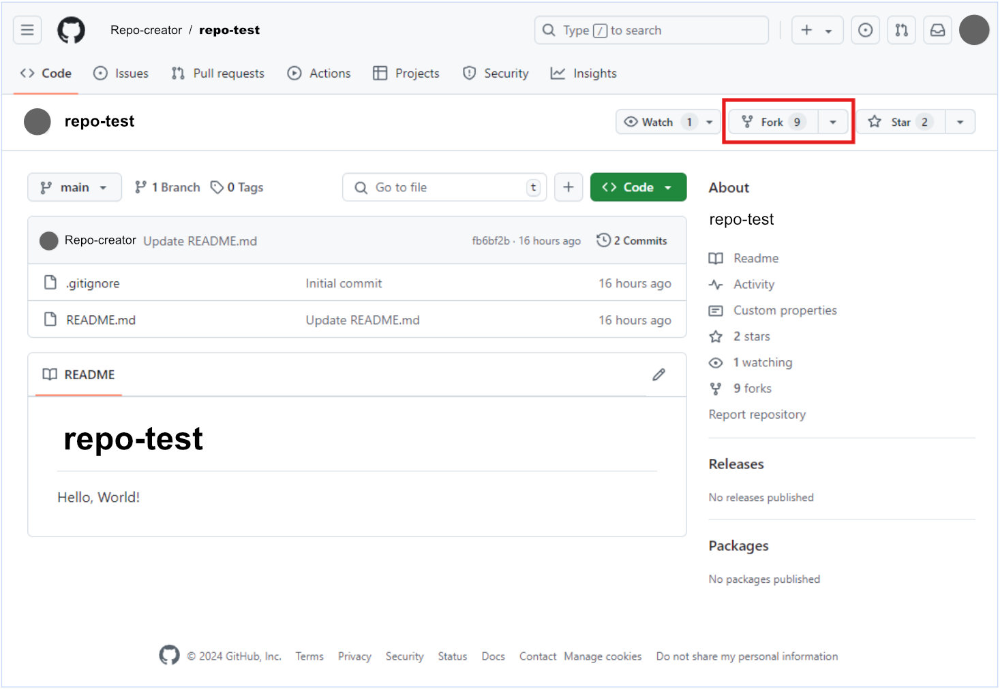
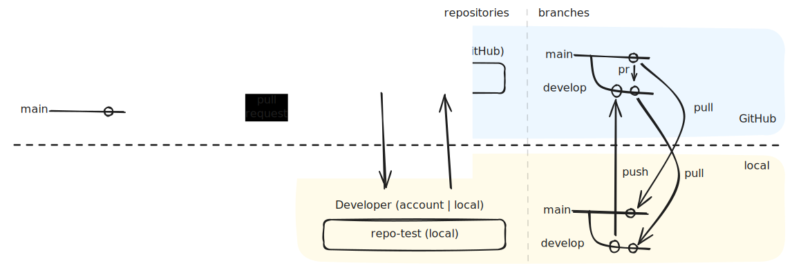

# Flujo de trabajo de Git (GitFlow)

Usaremos el método [*GitFlow*](../GLOSARIO.md#gitflow) para trabajar con nuestro repositorio.

Para ilustrar mejor este ejemplo vamos a imaginar que trabajamos en el repositorio ***(repo-test)*** que ha creado otro desarrollador ***(Repo-creator)***. Si *Repo-creator* nos ha añadido a *repo-test* como colaboradores, podemos acceder al repositorio desde ***www.github.com/Repo-creator/repo-test***

* Creador del repositorio: ***Repo-creator***
* Repositorio: ***repo-test***
* Nosotros: ***Developer***

 

## *Fork*

Cada desarrollador duplica (con ***fork***) la rama *main* de *repo-test* desde ***www.github.com/Repo-creator/repo-test***

 

## Ramas *(branches)* e instancias de los repositorios *(upstream, origin y local)*

Los desarrolladores no trabajamos en la rama *main*, si no en la rama ***develop*** del repositorio. Después de duplicar el **repositorio central  *(upstream)*** mediante *fork*, cada desarrollador trabaja en la rama *develop* desde su ordenador *(local)*, luego lo sincroniza con la rama *develop* de GitHub en la nube *(origin)* y finalmente hace una **petición de revisión y aprobación de cambios *(pull request)*** hacia el repositorio central *(upstream)*. Esta es la manera de ir mejorando el código de una manera eficiente y segura.

Instancias de los repositorios:

* ***upstream***: repositorio **central** en [GitHub](../GLOSARIO.md#github) creado por *Repo-creator*.
* ***origin***: repositorio en [GitHub](../GLOSARIO.md#github), duplicado del central mediante *fork* por el desarrollador.
* ***local***: repositorio local en la máquina del desarrollador

A continuación veremos como [inicializar nuestro primer repositorio local](./07-inicializacion-sincronizacion-repositorio-local.md) y sincronizarlo con el repositorio *origin*.