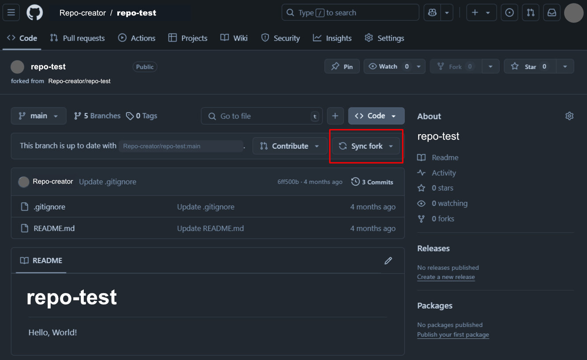
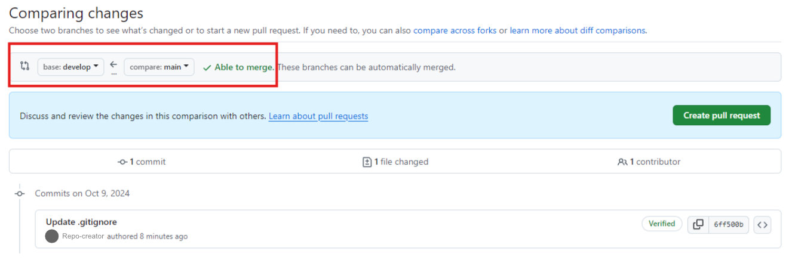

# Inicialización y sincronización de un repositorio local ***(Work In Progress)***

## 1. Inicialización del repositorio *(git init)*

Convertimos el directorio *repo-test*, que habíamos [creado anteriormente](./04-preparacion-entorno-git-github.md#4-creación-de-los-directorios-carpetas-de-nuestro-futuro-repositorio), en un repositorio de [Git](../GLOSARIO.md#git). Para ello nos situamos en la carpeta con la consola de [Git Bash](../GLOSARIO.md#git-bash) y, usamos el comando ```git init```. Esto genera automáticamente un directorio *.git* que **no debemos modificar**, ya que permite a [Git](../GLOSARIO.md#git) saber que la carpeta *repo-test* es un repositorio.

<br>

## 2. Sincronización de los repositorios *origin-local*

A continuación sincronizamos el repositorio *local* que acabamos de crear con el repositorio en *origin* en [GitHub](../GLOSARIO.md#github). Lo haremos copiando la *url* de nuestro repositorio ***(https://github.com/Username/repo-test)*** y utilizando el comando ```git remote add origin https://github.com/Username/repo-test```.

<br>

## 3. Descarga del repositorio *origin* a *local*

Ahora podemos descargar el repositorio *origin* en [GitHub](../GLOSARIO.md#github) a nuestro repositorio *local* con el comando ```git fetch```. Con ```git branch -a``` podemos ver la rama del repositorio *origin* a la estamos conectados. Por defecto [Git](../GLOSARIO.md#git) asigna una rama *master*, podemos cambiar a la rama *main* con el comando ```git switch main```.

<br>

## 4. Creación y cambio a la rama *develop*

Si no hemos creado la rama *develop* desde [GitHub](../GLOSARIO.md#github), la podemos crear en *local* desde la consola con ```git branch -c develop``` y cambiar a la rama mediante ```git switch develop```. Podemos **subir y vincular la rama** con nuestro repositorio *origin* en [GitHub](../GLOSARIO.md#github) con el comando ```git push -u origin develop```.

Si creamos un directorio (carpeta) en la nueva rama y queremos que [Git](../GLOSARIO.md#git) lo tenga en cuenta, debemos generar dentro de la carpeta un archivo ***.gitkeep***. Esto es necesario ya que [Git](../GLOSARIO.md#git) no tiene en cuenta las carpetas vacías.

Podemos crear una **nueva carpeta** desde la consola con ```mkdir nueva-carpeta``` y crear el **archivo *.gitkeep*** con el comando ```touch nueva-carpeta/.gitkeep```.

<br>

## 5. Añadir cambios locales *(git add)*, guardarlos *(git commit)* y subirlos a *origin (git push)*

### ```git add```
Los cambios que realicemos en *nueva-carpeta* solo existen en *local*. Podemos registrar los cambios, por ejemplo la creación del archivo *.gitkeep* mediante el comando ```git add nueva-carpeta```. Con esto, hemos añadido esos cambios al *staging area*, es decir le hemos dicho a [Git](../GLOSARIO.md#git) que hay cambios de nuestro repositorio *local* que vamos a subir a nuestro repositorio origin.

### ```git commit```
Para **aceptar o guardar estos cambios**, debemos usar el comando ```git commit```, o mejor aún ```git commit -m 'add .gitkeep file'```. El ```-m``` permite guardar los cambios con un **mensaje descriptivo** (siempre entre comillas simples o dobles), que queda registrado y podremos ver en [GitHub](../GLOSARIO.md#github).

En este punto puede saltar un error y [Git](../GLOSARIO.md#git) puede pedirnos identificación, podemos identificarnos con los comandos:

```git config --global user.email “user@mail.com”``` (mail de la cuenta de GitHub)

```git config --global user.name “Username”``` (Nombre de usuario en GitHub)

### ```git push```
Con ```git commit``` los cambios estarían guardados para la proxima subida, pero no se sincronizarán con el repositorio *origin* en [GitHub](../GLOSARIO.md#github) hasta que usemos el comando ```git push```.

Si no hemos creado y sincronizado la rama previamente en el repositorio remoto *(origin)* puede saltar un error, para solucionarlo usamos el comando ```git push --set-upstream origin develop``` o su forma abreviada ```git push -u origin develop``` ([Git](../GLOSARIO.md#git) puede pedir credenciales en este paso).

<br>

## 6. Tokens de Git

En ocasiones [Git](../GLOSARIO.md#git) bloquea el acceso por motivos de seguridad y lo muestra en consola con un icono de un candado 🔒. Debemos generar un **token** temporal desde la página de [GitHub](../GLOSARIO.md#github) para poder acceder. Podemos generarlo en: *Perfil > settings > Developer Settings > Personal access tokens > Tokens (classic)* (https://github.com/settings/tokens)


Pedimos un **token clásico**, le asignamos un nombre, marcamos las casillas que necesitemos y especificamos el tiempo que queremos que el token siga activo. Después **copiamos el token y lo pegamos en la consola** donde nos los pida [Git](../GLOSARIO.md#git) 🔒.

<br>

## *.gitignore*

Usaremos el fichero *.gitignore* para pedir a [Git](../GLOSARIO.md#git) que **ignore ciertos archivos del sistema** a la hora de subirlos al repositorio *origin*, normalmente archivos que crean los sistemas operativos y no necesitamos en nuestro repositorio.

Podemos encontrar ficheros a ignorar en [gitignore.io](https://www.toptal.com/developers/gitignore) para añadir a nuestro fichero *.gitignore.*

<br>

## 7. Propagar cambios entre repositorios de GitHub *(Sync Fork y Pull Request)*

Para propagar un cambio en un archivo del **repositorio central** *(upstream)* en [GitHub](../GLOSARIO.md#github) a nuestro repositorio *origin* usaremos el botón ***Sync fork***. Los cambios en la rama *main* del repositorio *upstream* se han sincronizado con la rama *main* de nuestro repositorio *origin*.



Para propagar ese cambio a nuestra rama *develop* debemos hacer un ***Pull Request (pr).***

Es importante fijarse en el orden del *pull request*, la rama “madre” quedará a la derecha y en la que queremos aplicar los cambios a la izquierda, con la flecha apuntando hacia ella, como en el siguiente ejemplo:



Al pulsar el botón verde ***Create pull request*** en la pestaña ***Pull requests*** de nuestro repositorio nos avisará de una nueva *pr*, ahí podremos ver el autor de la propuesta, los archivos implicados e incluso las diferencias entre el archivo original y el propuesto. Cuando estemos seguros de que todo es correcto, aceptamos la *pr* mediante el botón ***Merge pull request***.

<br>

## 8. Propagar cambios de origin a local *(git pull)*

Podemos descargar (```fetch```) los cambios de todas las ramas remotas a sus respectivas ramas locales y fusionarlos (```merge```) en la rama activa con el comando ```git pull --all``` en nuestra consola.

Si estábamos trabajando en la rama *develop* esto descarga (```fetch```) los cambios a todas las ramas pero solo fusiona (```merge```) *develop*. Al cambiar de rama a *main* con ```git switch main```, [Git](../GLOSARIO.md#git) avisa de que la rama *main* no está sincronizada, podemos realizar otro ```git pull --all``` para propagar este cambio también a *main*.

Recordemos el esquema de trabajo de [GitFlow](../GLOSARIO.md#gitflow):


<br>

## 9. *Features branches*

Las ***features branches*** son las ramas del repositorio donde trabajaremos **características o tareas específicas**. Usaremos **una rama** nueva **para cada *feature***. La creamos desde la consola, con *develop* como rama activa, mediante el comando ```git branch feature/ejemplo```. Podemos cambiar a esa rama mediante ```git switch```, crear, por ejemplo un directorio con ```mkdir``` y un archivo *.gitkeep* con ```touch directorio/.gitkeep```

Para **sincronizar los cambios y la nueva rama** *(feature/ejemplo)* con el repositorio *origin* (donde aún no existe), usaremos el comando ```git push --set-upstream origin feature/playground```.

<br>

## 101. *Issue tracking*

El ***issue tracking*** se refiere a la gestión de incidencias o tareas, y contamos con distintos *softwares* dedicados a ello. [Jira](../GLOSARIO.md#jira) es el *software* de *issue tracking* más usado en desarrollo web.

También existe la pestaña ***Issues*** dentro [GitHub](../GLOSARIO.md#github). Podemos crear un *issue* desde *(github.com/Username/repo-name/issues)*. Dentro del *issue*, en el icono de los tres puntos, en *edit*, podemos crear casillas para cada tarea.